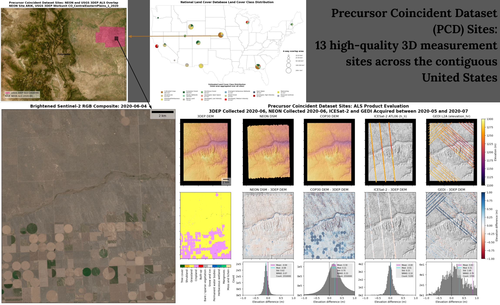

# Coincident

Over the past two decades, large archives of 3D surface elevation measurements
have been acquired from a range of airborne and satellite platforms. Many of
these datasets are now publicly available from cloud storage, enabling
efficient, on-demand search, subsetting, and data access.

This Python package provides functions to conveniently _search_ across different
[data providers](./user_guide/datasets.md) for coincident elevation
measurements. It also provides utilities to efficiently load measurements into
GeoPandas and Xarray for intercomparison.



## Documentation structure

The documentation is separated into three main _sections_ accessible on the top
navigation bar: The [User Guide](./user_guide/index.md) is the best place to get
started, [Examples](./examples/index.md) showcase Jupyter Notebooks which
highlight different datasets and common analysis workflows, and the
[API Reference](./api.rst) documents all available functions. For any given
section, _subsections_ appear on the left-hand navigation bar, and for any given
subsection _page_ headers appear on the right-hand navigation bar.

See the following website for more details on the motivation for this project!
<https://science.nasa.gov/earth-science/decadal-surveys/decadal-stv/coincident-datasets>

```{toctree}
:hidden:

user_guide/index.md
examples/index.md
datasets/index.md
api.rst
```
